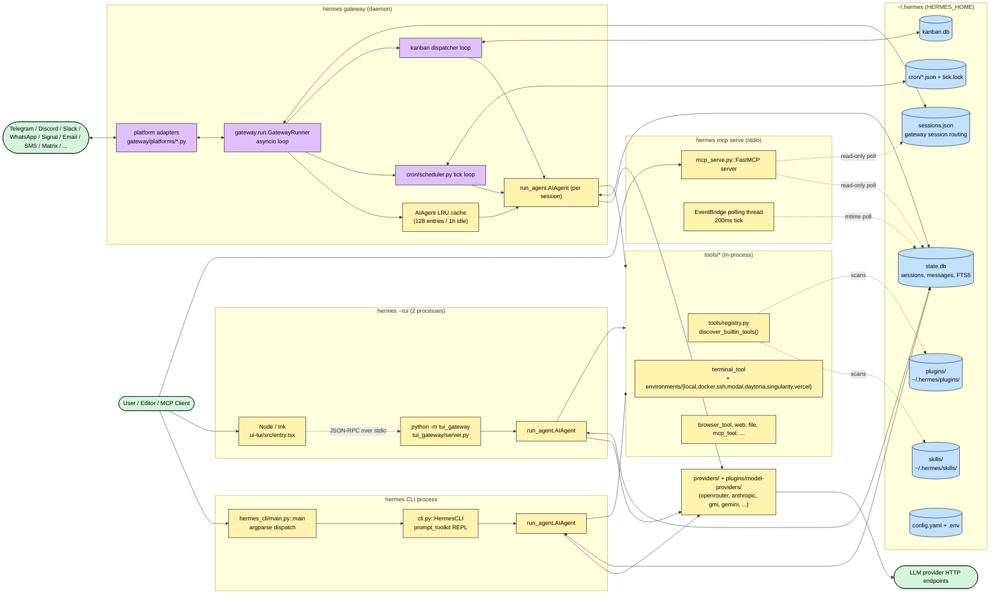

# Upstream Architecture Overview — `nousresearch/hermes-agent`

> Single-page system overview. Read this before claiming any HermesTS port task.
> Source of truth: `/Users/knosis/.opensrc/repos/github.com/nousresearch/hermes-agent/main/`
> All file references are upstream paths (i.e. relative to that root), not the TS port.

---

## 1. What hermes-agent is

A single-tenant, self-hosted, model-agnostic AI agent runtime. One Python codebase exposes the same `AIAgent` loop through five distinct surfaces: an interactive terminal (CLI / TUI), a long-lived messaging gateway (Telegram, Discord, Slack, WhatsApp, Signal, email, SMS, etc.), an MCP server, an ACP server for IDE integration, and an offline batch trajectory generator. State (sessions, messages, FTS5 search, cron jobs, kanban) lives in SQLite files under `HERMES_HOME` (default `~/.hermes/`, profile-aware). Tools, skills, plugins, and model providers are all discovered at startup from filesystem layout — there is no static registration list. The agent loop itself is the same code path regardless of which surface invoked it.

---

## 2. Entry points

Two console scripts are declared in `pyproject.toml`:

```
[project.scripts]
hermes       = "hermes_cli.main:main"
hermes-agent = "run_agent:main"
```

Every other "entry point" is a subcommand of `hermes` (argparse subparsers, defined in `hermes_cli/main.py:10645+`).

| Entry point | Invoked by | Purpose | Depends on |
|---|---|---|---|
| `hermes` (= `hermes chat`) | User (interactive terminal) | Classic prompt_toolkit REPL → `HermesCLI` orchestrator (`cli.py:2801`) → in-process `AIAgent` | `cli.py`, `agent/`, `tools/`, `hermes_state.py` |
| `hermes --tui` / `HERMES_TUI=1` | User (interactive terminal) | Spawns Ink (Node) UI; UI talks JSON-RPC over stdio to Python `tui_gateway/server.py`, which embeds `AIAgent` | `ui-tui/`, `tui_gateway/`, `agent/` |
| `hermes gateway run` / `start` | User / systemd | Long-lived daemon: `gateway.run.GatewayRunner` connects every configured platform adapter, fans messages out, lazily constructs one `AIAgent` per session (cached, LRU-evicted) | `gateway/`, `agent/`, `hermes_state.py`, `cron/scheduler.py` (embedded) |
| `hermes acp` | VS Code / Zed / JetBrains via ACP | ACP server (Agent Client Protocol) — editor sends requests, server runs `AIAgent` and streams turns back | `acp_adapter/`, `agent/` |
| `hermes mcp serve` | Any MCP client (Claude Desktop, Cursor, Codex) | stdio MCP server (`mcp_serve.py:866 run_mcp_server`) exposing 10 tools that read the gateway's `sessions.json` + `state.db` and poll for new messages | `mcp_serve.py`, `hermes_state.py` |
| `hermes-agent` (= `python -m run_agent`) | Programmatic / scripts | Bare `AIAgent.run_conversation` driver via `fire` — single-shot, no REPL, no gateway | `run_agent.py`, `agent/`, `tools/` |
| `python batch_runner.py` | Researchers (trajectory generation) | Loads a JSONL dataset, fans rows out across a `multiprocessing.Pool`, each worker instantiates its own `AIAgent`, results saved as trajectories | `batch_runner.py`, `run_agent.py`, `toolset_distributions.py` |
| `hermes cron <verb>` + `cron/scheduler.py` | User / dispatcher loop | Schedules and dispatches cron jobs. Tick loop normally runs inside the gateway process; can be detached. | `cron/`, `agent/`, gateway delivery |
| `hermes kanban dispatch` / `daemon` | User / dispatcher loop | Long-poll loop that claims tasks from the `kanban.db` board and spawns `AIAgent` workers per claim (also lives inside the gateway by default — `kanban.dispatch_in_gateway: true`) | `hermes_cli/kanban*.py`, `tools/kanban_tools.py`, `agent/` |

The `hermes_bootstrap.py` (129 LOC) module is imported as the very first line of every entry point. On Windows it forces `PYTHONUTF8=1` and reconfigures stdio to UTF-8; on POSIX it is a no-op. All entry points wrap the import in `try/except ModuleNotFoundError` to survive a partial `hermes update` that left the editable install half-applied.

---

## 3. Process model

Three distinct shapes, depending on surface:

**a) Single-process, in-thread agent loop.** `hermes` (classic CLI), `hermes acp`, `hermes mcp serve`, `hermes-agent`, and direct `AIAgent` use share one Python process. The agent loop (`agent/conversation_loop.py:run_conversation`) runs synchronously on the main thread; provider HTTP calls are blocking. Tool dispatch is sync, with up to `_MAX_TOOL_WORKERS = 8` parallel tool calls using `concurrent.futures` (`run_agent.py:209`). Interrupts are cooperative — `tools/interrupt.py::set_interrupt` toggles a flag the loop checks between iterations.

**b) TUI: parent Node, child Python over stdio JSON-RPC.** `hermes --tui` spawns Node (Ink) as the parent. The Node process spawns `python -m tui_gateway` as a child and pipes newline-delimited JSON-RPC over stdio (`AGENTS.md:213`). TypeScript owns the screen; Python owns sessions, tools, model calls, and slash-command logic. A persistent `_SlashWorker` subprocess handles slash commands that need a fresh interpreter. The dashboard at `/chat` embeds the same Ink TUI over a WebSocket PTY (`hermes_cli/pty_bridge.py` + `hermes_cli/web_server.py` `@app.websocket("/api/pty")`), so any feature added to Ink shows up in the browser too.

**c) Gateway: one daemon, N adapter coroutines, M cached AIAgents.** `gateway.run.GatewayRunner` is a long-lived `asyncio` event loop. Each platform adapter (`gateway/platforms/{telegram,discord,slack,whatsapp,signal,matrix,mattermost,email,sms,dingtalk,wecom,weixin,feishu,qqbot,bluebubbles,yuanbao,webhook,api_server,homeassistant}.py`) runs as a coroutine. When a message arrives, the runner resolves a session key, gets or constructs an `AIAgent` from an LRU cache bounded at `_AGENT_CACHE_MAX_SIZE = 128` with `_AGENT_CACHE_IDLE_TTL_SECS = 3600` (`gateway/run.py:64`), and runs that agent's turn. Cron and kanban dispatchers run on their own asyncio tasks inside the same process. Background work that should outlive the turn (`terminal(background=True)`, etc.) is spawned through `asyncio.create_subprocess_exec` with a watcher coroutine that fires a new agent turn on completion. The Docker image runs as a non-root `hermes` user under `tini` (PID 1 zombie reaper), entrypoint `gateway run`.

State is shared between (a), (b), and (c) via `hermes_state.py::SessionDB` — a single `state.db` SQLite file in WAL mode (with a documented DELETE-mode fallback for NFS/SMB/FUSE — see `apply_wal_with_fallback`). Multiple processes safely read; one writes at a time. Profile isolation is `HERMES_HOME`-scoped: `hermes_cli/main.py::_apply_profile_override` mutates `os.environ["HERMES_HOME"]` *before* any other import, so module-level `get_hermes_home()` constants get the right value at import time.

Delegation (`tools/delegate_tool.py`) spawns subagent **threads**, not processes — the child runs in the same Python interpreter and is cancelled if the parent is interrupted. Concurrency is capped by `delegation.max_concurrent_children` (default 3), spawn depth by `delegation.max_spawn_depth` (default 2). The MCP server (`mcp_serve.py`) runs a background polling thread (`EventBridge._poll_loop`) that watches `state.db` and `sessions.json` mtimes every 200ms.

---

## 4. Runtime topology



Process boundaries are the solid `subgraph` borders. Everything *inside* one subgraph is the same Python interpreter (with caveats: TUI is two processes that look like one product; gateway hosts cron + kanban as asyncio tasks). Everything *across* boundaries goes through SQLite, JSON files, JSON-RPC over stdio, or HTTP.

---

## 5. Request lifecycle

Trace of a typical user message → assistant response. The same end-to-end path applies whether the entry point is CLI, gateway, or TUI; only the framing differs.

1. **Entry-point parses argv and sets `HERMES_HOME`.** `hermes_cli/main.py::main` runs `_apply_profile_override()` (`hermes_cli/main.py:183`) to mutate `os.environ["HERMES_HOME"]` before anything else imports `hermes_constants`. Subcommand dispatch (`subparsers.add_parser(...)` at `hermes_cli/main.py:10957+`) routes to the right handler.
2. **Config + .env load.** `cli.py::load_cli_config` (`cli.py:330`) merges hardcoded defaults with `$HERMES_HOME/config.yaml`. `hermes_cli/env_loader.py::load_hermes_dotenv` reads `$HERMES_HOME/.env` then project `.env`.
3. **Tool discovery.** First import of `model_tools` triggers `tools.registry.discover_builtin_tools()` (`model_tools.py:180`) which imports every `tools/*.py` and lets each call `registry.register(...)`. Then `hermes_cli.plugins.discover_plugins()` runs (`model_tools.py:197`) and lets plugins register additional tools, hooks, and CLI subcommands.
4. **Session resolution.**
   - CLI: `HermesCLI.__init__` opens `SessionDB` (`hermes_state.py:34`), either resumes the last session or creates a fresh one.
   - Gateway: adapter receives a platform message, computes a session key (`gateway/session.py:600 build_session_key`), and either reuses an in-cache `AIAgent` or builds a new one and writes a row to `state.db` + `sessions.json`.
5. **System prompt build (cache-aware).** `agent/conversation_loop.py::_restore_or_build_system_prompt` (`agent/conversation_loop.py:130`) tries to reuse the previously-stored system prompt verbatim so the Anthropic prefix cache hits. If absent or stale, it rebuilds from `DEFAULT_AGENT_IDENTITY` + platform hints + skills + memory + context files + SOUL.md (`agent/prompt_builder.py`) and writes it back.
6. **Provider client construction.** `_create_openai_client` resolves provider headers (Qwen, RouterMint, Anthropic OAuth, etc.) and instantiates an `OpenAI`-compatible client (`run_agent.py:75`). The SDK import is lazy (`_OpenAIProxy`) so cold startup doesn't pay ~240ms.
7. **Agent loop runs the turn.** `agent/conversation_loop.py::run_conversation` is the ~3,900-line body that drives a single user turn:
   ```python
   while api_call_count < max_iterations and budget.remaining > 0:
       if interrupt_requested: break
       response = client.chat.completions.create(model=, messages=, tools=tool_schemas)
       if response.tool_calls:
           for tool_call in response.tool_calls:
               result = handle_function_call(tool_call.name, tool_call.args, task_id)
               messages.append(tool_result_message(result))
           api_call_count += 1
       else:
           return response.content
   ```
   Inside that loop: streaming consumer parses SSE; reasoning content goes into `assistant_msg["reasoning"]`; non-ASCII / surrogate sanitization (`agent/message_sanitization.py`); tool-call argument repair (`agent/message_sanitization.py::_repair_tool_call_arguments`); error classification + retry/failover (`agent/error_classifier.py::classify_api_error`); context compression triggered at `compression.threshold` of the model's context limit (`agent/context_compressor.py`); prompt-cache markers via `apply_anthropic_cache_control`.
8. **Tool dispatch.** `model_tools.py::handle_function_call` looks the name up in the registry, runs any `pre_tool_call` plugin hooks, dispatches the handler (file-mutating tools serialize, parallel-safe tools fan out across up to `_MAX_TOOL_WORKERS = 8` workers — `agent/tool_dispatch_helpers.py`), runs `post_tool_call` hooks, persists oversized output to a temp file (`tools/tool_result_storage.py::maybe_persist_tool_result`), and returns a JSON string.
9. **Persistence.** Each assistant + tool message round-trip is written to `state.db` via `SessionDB.add_message`. FTS5 triggers index the content (`hermes_state.py:255`).
10. **Response framing.**
    - CLI: `_strip_reasoning_tags` (`cli.py:187`) sanitizes, prompt_toolkit renders, output is mirrored into a persistent history ring.
    - Gateway: `_sanitize_gateway_final_response` (`gateway/run.py:208`) runs platform-specific transforms (e.g. `_telegramize_command_mentions`), secret redaction (`_redact_gateway_user_facing_secrets`), and the adapter ships the text back over the messaging platform.
    - TUI: `message.delta` / `message.complete` JSON-RPC events stream to Ink.

Total round-trip is one or more API calls (gated by `max_iterations`, default 90) plus N tool invocations.

---

## 6. State lifecycle

`hermes_state.py` (3,279 LOC, schema version 13) defines `SessionDB`, a thin wrapper over a single SQLite file at `get_hermes_home() / "state.db"`. The schema:

- `sessions` — one row per session, tagged with `source` (`'cli'`, `'telegram'`, `'discord'`, etc.), plus model/system_prompt cache, parent linkage (`parent_session_id` chains for compression-triggered splits), token + cost accounting, handoff state.
- `messages` — full message history. `tool_calls`, `tool_call_id`, `reasoning`, `reasoning_content`, `codex_reasoning_items` are all preserved verbatim so a turn can be replayed.
- `messages_fts` (unicode61) + `messages_fts_trigram` (CJK-safe substring search) — FTS5 virtual tables synced via INSERT/DELETE/UPDATE triggers.
- `state_meta` — KV store for ad-hoc process-wide flags.

Lifecycle:

- **Created** by `SessionDB.create_session(source, ...)` on first turn of a new conversation, or implicitly during gateway message handling when no session key matches.
- **Loaded** on every turn via `SessionDB.get_session(session_id)` + `get_messages(session_id)`. The CLI loads at startup; the gateway loads when constructing or rebuilding an `AIAgent` for that session.
- **Updated** continuously — every message round-trip writes one or more rows. Token counts and cost estimates are updated as usage events arrive from the provider. The cached system prompt is updated only when it actually changes (cache discipline).
- **Compressed** when the conversation hits `compression.threshold` (default 50% of context limit). `agent/context_compressor.py` summarizes prior turns into one message and writes a new `parent_session_id`-linked child session, preserving the chain for `/branch` and `/resume`.
- **Closed** by `SessionDB.end_session(session_id, end_reason)` — on graceful CLI exit, gateway agent cache eviction, or compression handoff. Sessions are never deleted; archives stay queryable.
- **Searched** by `SessionDB.search_messages(query)` which spans both FTS5 indexes. The `session_search` toolset uses this for cross-session recall.

Other state files in `HERMES_HOME`:
- `sessions/sessions.json` — gateway-side session routing index (session_key → platform, chat_id, thread_id, session_id). MCP reads this directly without going through `SessionStore`.
- `channel_directory.json` — cached list of gateway channels for `messages_send`.
- `cron/jobs.json` + `cron/.tick.lock` — cron job store and per-process file lock preventing duplicate ticks.
- `kanban.db` — multi-agent work queue (separate SQLite DB, same WAL+fallback wrapper).
- `auth.json` — pooled credentials (provider rotation).
- `skills/.usage.json` — per-skill telemetry maintained by the curator.
- `skills/.archive/` — curator-archived skills (restorable, never deleted).

NFS/SMB/FUSE filesystems silently break SQLite WAL mode. `apply_wal_with_fallback` (`hermes_state.py:128`) catches `OperationalError("locking protocol")` and falls back to `journal_mode=DELETE`, logging one warning per (process, db_label) pair.

---

## 7. Plugin and skill loading

Both are **filesystem-discovered**, not statically registered. Discovery is split into several distinct systems with different lifecycles — important to get right in the port.

### Tools
- `tools/registry.py` holds `registry`, a singleton.
- `tools/*.py` files each call `registry.register(name=..., toolset=..., schema=..., handler=..., check_fn=..., requires_env=...)` at import time.
- `tools.registry.discover_builtin_tools()` imports every `tools/*.py` once. Triggered by first import of `model_tools` (`model_tools.py:180`).
- Toolsets group tools (`toolsets.py::TOOLSETS`); each platform's adapter picks a base toolset (e.g. Telegram uses `"messaging"`). `_HERMES_CORE_TOOLS` is the default bundle most platforms inherit.
- A tool is only *exposed to the agent* if its name appears in some toolset — registration alone is not enough.

### General plugins (`hermes_cli/plugins.py`)
- `PluginManager` discovers plugins from `~/.hermes/plugins/`, `./.hermes/plugins/`, and pip entry points.
- Each plugin's `register(ctx)` can register tools (`ctx.register_tool`), CLI subcommands (`ctx.register_cli_command` — wired into the `hermes` argparse tree at startup), and lifecycle hooks: `pre_tool_call`, `post_tool_call`, `pre_llm_call`, `post_llm_call`, `on_session_start`, `on_session_end`.
- Tool hooks fire in `model_tools.py`; lifecycle hooks fire in `run_agent.py`.
- **Pitfall:** `discover_plugins()` only runs as a side effect of importing `model_tools.py`. Paths that read plugin state without importing `model_tools` must call `discover_plugins()` explicitly (it's idempotent).

### Memory-provider plugins (`plugins/memory/<name>/`)
- Separate discovery (`discover_memory_providers()`), distinct from `PluginManager`.
- Each implements the `MemoryProvider` ABC (`agent/memory_provider.py`) — `sync_turn`, `prefetch`, `shutdown`, optional `post_setup(hermes_home, config)`.
- Built-in providers: `honcho`, `mem0`, `supermemory`, `byterover`, `hindsight`, `holographic`, `openviking`, `retaindb`. **Set is closed** — new providers must ship as standalone repos.
- The framework only wires CLI subcommands for the currently active memory provider (read from `memory.provider` in `config.yaml`).

### Model-provider plugins (`plugins/model-providers/<name>/`)
- Lazy, separate discovery in `providers/__init__.py::_discover_providers()` — scanned on first `get_provider_profile()` / `list_providers()` call, NOT by `PluginManager`.
- Each plugin's `__init__.py` calls `providers.register_provider(ProviderProfile(...))`.
- Scan order: bundled `<repo>/plugins/model-providers/<name>/`, then user `$HERMES_HOME/plugins/model-providers/<name>/`, then legacy `<repo>/providers/<name>.py`. **User plugins override bundled ones** (last-writer-wins).

### Context-engine + image-gen plugins
- Same ABC-plus-orchestrator pattern (`plugins/context_engine/`, `plugins/image_gen/`). ABCs in `agent/context_engine.py`, `agent/image_gen_provider.py`.

### Skills (`skills/`, `optional-skills/`, `~/.hermes/skills/`)
- A skill is a directory with a `SKILL.md` (frontmatter: `name`, `description`, `version`, `platforms`, `metadata.hermes.{tags,category,related_skills,config}`) plus optional `scripts/`, `references/`, `templates/`.
- `agent/skill_commands.py::scan_skill_commands` scans the skills tree and builds `_skill_commands: Dict[str, Dict[str, Any]]`.
- Slash invocation (`/<skill-name>`) injects the skill content as a **user message** (not system prompt) so the prompt cache stays valid.
- `tools/skills_hub.py::OptionalSkillSource` lets users install optional skills with `hermes skills install official/<category>/<skill>`.
- `agent/curator.py` runs a background review loop, tracks usage in `~/.hermes/skills/.usage.json`, and auto-archives stale agent-authored skills (`created_by: "agent"` only). Bundled and hub-installed skills are off-limits to the curator.

### MCP servers (external tools-as-a-service)
- Configured in `config.yaml` under `mcp:`. `tools/mcp_tool.py` connects via stdio or HTTP, lists tools, and registers each as a Hermes tool. Auth lives in `tools/mcp_oauth.py` / `tools/mcp_oauth_manager.py`.

---

## 8. Cross-cutting concerns

| Concern | Where it lives | How every component participates |
|---|---|---|
| **Logging** | `hermes_logging.py::setup_logging()` | All entry points call this early. Writes `~/.hermes/logs/{agent,errors,gateway}.log` (profile-aware). `set_session_context()` injects the current session_id into log records. Browse with `hermes logs --follow`. |
| **Config** | `hermes_cli/config.py::DEFAULT_CONFIG` + `load_config()`; `cli.py::load_cli_config()`; gateway reads raw YAML | Three distinct loaders (see AGENTS.md). All read `$HERMES_HOME/config.yaml`. Secrets-only go in `$HERMES_HOME/.env`. Adding a new key in the wrong loader silently breaks one surface. |
| **Profiles** | `hermes_cli/main.py::_apply_profile_override()` | Mutates `HERMES_HOME` before any module imports. Every state path must go through `hermes_constants.get_hermes_home()` (code) / `display_hermes_home()` (user-facing). Hardcoded `~/.hermes` paths break profiles. |
| **Error handling** | `agent/error_classifier.py` + provider-specific adapters in `agent/*_adapter.py` | `classify_api_error` returns a `FailoverReason` enum that drives the loop's retry / backoff / failover decision. Credential pool (`agent/credential_pool.py`) rotates on 401/429 when available. |
| **Approval / guardrails** | `tools/approval.py`, `agent/tool_guardrails.py`, `gateway/run.py` runtime gates | Tool calls flow through `ToolCallGuardrailController` (`agent/tool_guardrails.py`). Gateway has **two** message guards (base adapter + runner) and approval/control commands must bypass both — common porting trap (AGENTS.md). |
| **Prompt caching** | `agent/prompt_caching.py::apply_anthropic_cache_control` | Hard rule: do not alter past context, toolsets, or memory mid-conversation. The only allowed mid-session rebuild is during compression. Slash commands that mutate prompt state must default to deferred invalidation with `--now` opt-in. |
| **Auth / credentials** | `hermes_cli/auth.py`, `agent/credential_*.py`, `agent/google_oauth.py`, `agent/azure_identity_adapter.py` | Per-provider OAuth flows + a pooled-credential rotation system shared by the agent loop. `auth.json` stores pool state. |
| **Telemetry / observability** | `plugins/observability/`, `tools/skill_usage.py`, session token accounting in `state.db` | Per-skill counts, per-session cost estimates. Optional traces/metrics via observability plugin. |
| **Interrupts** | `tools/interrupt.py::set_interrupt`, `_interrupt_requested` flag on `AIAgent`, `running_agent.interrupt()` in gateway | Cooperative — checked between loop iterations and inside long tool runs. Cron sessions have a hard 3-minute interrupt to prevent runaway loops. |
| **Sanitization** | `agent/message_sanitization.py`, `cli.py::_strip_reasoning_tags`, `gateway/run.py::_redact_gateway_user_facing_secrets` | Three-stage: input sanitization (surrogates, non-ASCII), tool-call arg repair, output redaction (reasoning tags, secret patterns, provider-policy text). Every surface participates. |
| **Internationalization** | `agent/i18n.py::t()` + `locales/` | Gateway uses `t("key")` for user-visible status strings. |
| **Security boundary** | `SECURITY.md §2.2` | The **only** real boundary is OS-level isolation (containerized terminal backends or running Hermes itself in a sandbox). Nothing in-process — no approval gate, no redactor, no allowlist — is a security boundary. Treat it that way when porting. |

---

## 9. Implications for the TS port

The architectural decisions below MUST be preserved. They are not implementation details; changing them silently breaks invariants the upstream codebase depends on.

1. **Two console scripts, multiple subcommands, single `AIAgent` core.** Keep the surface split (`hermes` / `hermes-agent`) and route every subcommand through one argparse-equivalent dispatcher (`hermes_cli/main.py`). Do not duplicate the agent loop per surface. CLI, gateway, MCP, ACP, batch, cron, kanban must all invoke the same `@hermests/agent` runtime — only framing differs.

2. **Single SQLite state file, schema v13, WAL with NFS fallback.** Port `hermes_state.py` byte-for-byte schema-wise. Use `better-sqlite3` (sync, matches Python's sync API; see `docs/dep-mapping.md`). Preserve `apply_wal_with_fallback` semantics and the `_log_wal_fallback_once` dedup so NFS users don't get a log flood. The FTS5 virtual tables + triggers MUST stay in sync — port the trigger SQL literally.

3. **Filesystem discovery for tools / plugins / skills / providers — not static imports.** Four distinct discovery systems (general plugins, memory providers, model providers, skills), each with its own scan order and override rules. Do not collapse them into one. Plugins MUST be able to register from `~/.hermes/plugins/` without modifying core. Discovery is idempotent; user plugins override bundled.

4. **Profile-aware paths via `getHermesHome()` / `displayHermesHome()`.** `HERMES_HOME` is set *before* any module loads its constants. In Node, this means the equivalent helper must be called dynamically per access (or memoized with explicit reset for tests) — module-top `const HERMES_HOME = ...` is a bug. Hardcoding `~/.hermes` is the #1 profile-breaking mistake in the Python codebase (5 bugs in PR #3575) and the TS port should ban it at lint time.

5. **Cache-aware prompt construction is load-bearing for cost.** `_restore_or_build_system_prompt` reuses the previously-stored prompt verbatim so the Anthropic prefix cache hits. Mid-conversation prompt mutation forces a full reprice. The port must persist the cached prompt in the `sessions.system_prompt` column on first turn, restore it on subsequent turns, and rebuild only during compression. Slash commands that mutate prompt state default to deferred invalidation with a `--now` opt-in (see `/skills install --now` for the canonical pattern).

6. **Tool dispatch parallelism with file-mutation serialization.** Up to 8 parallel tool calls, but file-mutating tools (`_FILE_MUTATING_TOOL_NAMES`, `_NEVER_PARALLEL_TOOLS`) serialize, and parallel batches enforce path-overlap detection (`_paths_overlap`). Use a TS work-pool with the same rules — naïve `Promise.all` over all tool calls will corrupt state.

7. **Gateway has two message guards; control commands must bypass both.** When the agent is running, messages pass through base adapter queueing (`gateway/platforms/base.py::_pending_messages`) AND the runner's command intercept. Approval / `/stop` / `/new` / `/queue` / `/status` / `/approve` / `/deny` must bypass both and dispatch inline. Easy to break during the port; documented in AGENTS.md as a recurring footgun.

8. **The only real security boundary is OS isolation (terminal backends).** Do not invest porting effort in in-process "containment" of LLM output — it is documented in `SECURITY.md §2.2` as explicitly NOT a boundary. Heuristics like `_redact_gateway_user_facing_secrets`, approval prompts, and tool allowlists are best-effort UX hygiene, not security. Port them as such.

9. **Bootstrap-on-import for Windows UTF-8.** `hermes_bootstrap.py` is imported *first* in every entry point. The TS equivalent is much smaller (Node handles UTF-8 natively), but the entry-point load order discipline still matters: profile override must happen before any state-touching import.

10. **Process model differs by surface — preserve it.** CLI = one process, sync loop, cooperative interrupts. TUI = Node parent + Python child over stdio JSON-RPC. Gateway = one async daemon with per-session agent cache + cron + kanban as in-process tasks. Do not collapse them into a single "always-async, always-out-of-process" port; the existing model is load-bearing for latency (CLI cold start), embeddability (TUI inside dashboard), and resource accounting (gateway agent cache eviction). See `docs/dep-mapping.md` for the Node/TS analogues of `asyncio`, `concurrent.futures`, `multiprocessing.Pool`, and `prompt_toolkit`.

---

*Generated for HermesTS task #21. If this drifts from upstream, update it — every porter reads it before claiming work.*
